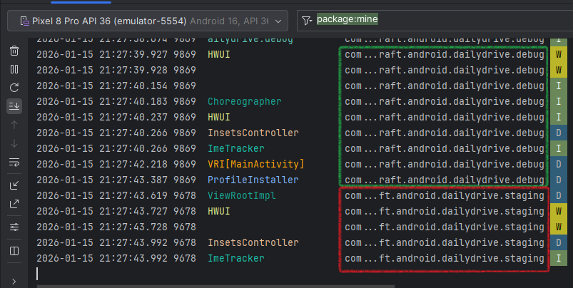
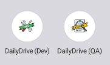
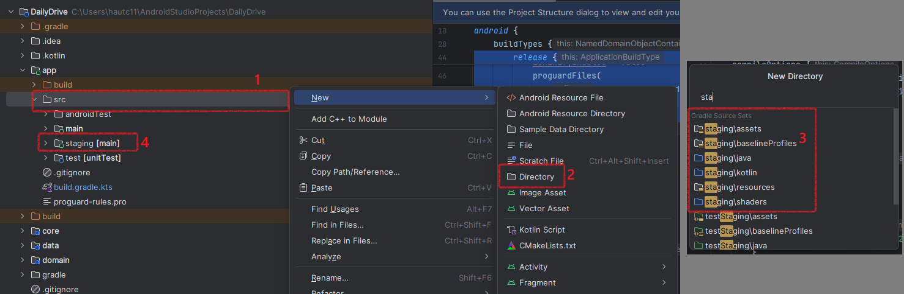
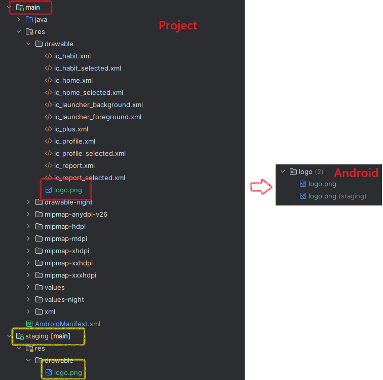

# Build Variants

## Build Types Vs. Build Flavors

<b>Build Type:</b> Usually refer to the environment in which you're testing. By default, when you create an app in Android Studio, you get two build types: `debug` and `release`. But you may know there are usually more than these two.

<b>Flavor:</b> Apps often vary in ways besides environment-based differences.
Flavor support these kinds of variations. For example, you can use flavors to handle:

- Having a paid version of your app vs. a free version.

- Having a version for each store you upload to, such as Amazon App Store, Google Play Store, Samsung Galaxy Store.

- Using the same app for different products and customizing the assets to change the app's look.

<b>Build variants:</b> are the combination of build types and build flavors. For example, you can have a "dev paid" version of your app, which is a combination of the "dev" build type and "paid" flavor of your app. If you have both flavors and types, you'll release variants when uploading to the Google Play Store or any other store.

`build.gralde.kts` (:module level)

```groovy
android {
    ...

    signingConfigs {
        create("release") {
            storeFile = file("my-release-key.jks")
            storePassword = "your-store-password"
            keyAlias = "your-key-alias"
            keyPassword = "your-key-password"
        }
    }

    buildTypes {
        debug {
            applicationIdSuffix = ".debug"
            versionNameSuffix = "-dev"
            isDebuggable = true
        }

        release {
            isMinifyEnabled = true
            isShrinkResources = true
            isDebuggable = false
            proguardFiles(
                getDefaultProguardFile("proguard-android-optimize.txt"),
                "proguard-rules.pro"
            )
            
            // Already define a config for signing.
            signingConfig signingConfigs.release
        }
    }

    flavorDimensions("environment")
    productFlavors {
        create("dev") {
            dimension = "environment"
            applicationIdSuffix = ".dev"
            versionNameSuffix = "-dev"
            buildConfigField("String", "BASE_URL", "\"https://dev.api.com/\"")
            resValue("string", "app_name", "DailyDrive (Dev)") // <- Use @string/app_name in `AndroidManifest.xml`.
        }

        create("staging") {
            dimension = "environment"
            applicationIdSuffix = ".staging"
            versionNameSuffix = "-staging"
            buildConfigField("String", "BASE_URL", "\"https://staging.api.com/\"")
            resValue("string", "app_name", "DailyDrive (QA)")
        }

        create("prod") {
            dimension = "environment"
            applicationIdSuffix = ".prod"
            versionNameSuffix = "-prod"
            buildConfigField("String", "BASE_URL", "\"https://prod.api.com/\"")
            resValue("string", "app_name", "DailyDrive")
        }
    }

    ...

    buildFeatures {
        compose = true
        buildConfig = true // <- Don't forgot this!
    }
}
```

## Results

1. We have different package name for different build variant.

   

2. Each variant have different app label/app name and logo.

   

3. Each variant have different directory for `res`

   - This is how we add new directory for `res` for new variant.

   

   - Add resource for each variant.

   

   - And we also do this for `strings.xml`, `values.xml`...

4. We can also have Variant-Specific Dependencies

   ```groovy
       dependencies {
           implementation("androidx.core:core-ktx:1.12.0")

           // Syntax: "flavorNameImplementation"
           // Only 'debug' and 'staging' (which copies debug) get this
           "debugImplementation"("com.squareup.leakcanary:leakcanary-android:2.12")
       }
   ```
