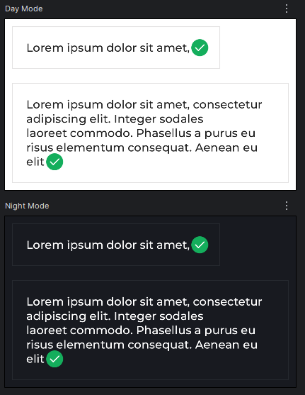

# Inline Content in Text (Jetpack Compose Android)

## 1. What Is Inline Content
**Inline Content** in Jetpack Compose allows you to **embed composable (icons, images, small UI)** directly **inside a `Text`**, instead of displaying only plaintext.

Typical use cases:
- Icons inside text
- Inline badges or indicators
- Rich text with precise alignment

---

## 2. When to Use Inline Content
Use Inline Content when:
- An icon or image must appear **in the same line as text**
- You need **proper baseline alignment** between text and UI

---

## 3. Core Components
Inline content in `Text` consists of two parts:

### 3.1 AnnotatedString
Used to **mark the position** of inline content with `appendInlineContent(id)`

### 3.2 inlineContent Map
Maps an `id` to `InlineTextContent`, which defines:
- The placeholder size
- The composable to be rendered

---

## 4. Basic Example

```kotlin
@Composable
fun NotificationStatusLabel(text: String) {

    val inlineId = "icon"
    val spacer = "spacer"

    Text(
        style = LabelRegular, color = colors.mainTextColor, text = buildAnnotatedString {
            append(text)
            appendInlineContent(spacer)
            appendInlineContent(inlineId)
        }, inlineContent = mapOf(
            inlineId to InlineTextContent(
                Placeholder(
                    width = 16.sp,
                    height = 16.sp,
                    placeholderVerticalAlign = PlaceholderVerticalAlign.Center
                )
            ) {
                Icon(
                    painter = painterResource(R.drawable.ic_completed),
                    contentDescription = "",
                    tint = null
                )
            }, spacer to InlineTextContent(
                Placeholder(
                    width = 6.sp,
                    height = 6.sp,
                    placeholderVerticalAlign = PlaceholderVerticalAlign.Center
                )
            ) {})
    )
}
```


