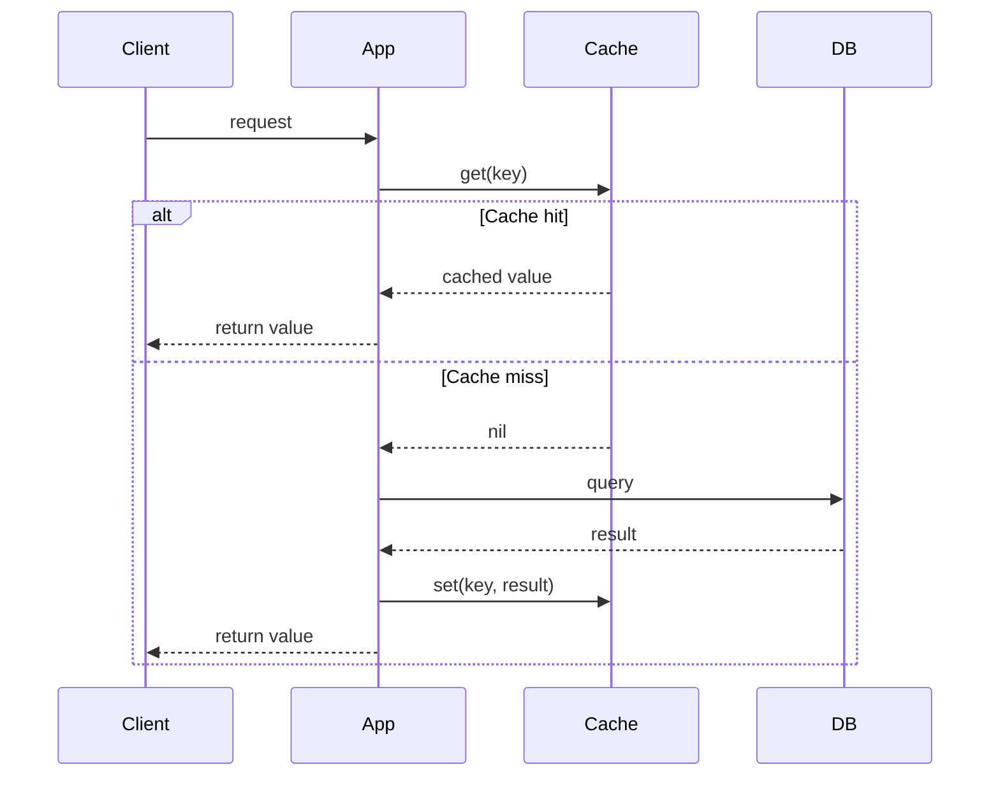
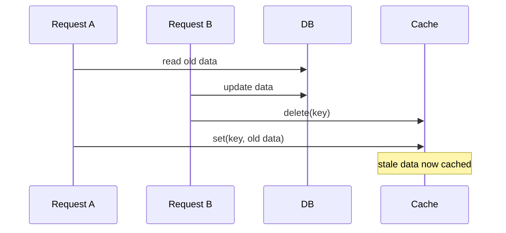

# Caching Notes: Cache-Aside, TTL, Cache Invalidation

## 1. Why bother with a cache at all

- DB queries are slow-ish, reading from memory is fast.
- If the same data gets read a lot more than it changes, hitting the DB every time is wasted work.
- Example: a product API gets hit 10k times/min, but the product itself only changes a couple times a day. No reason to query the DB every time for data that hasn't moved.
- Cache = a fast in-memory layer (lớp lưu trữ nằm trong bộ nhớ RAM, Redis, Memcached, etc.) sitting in front of the DB.
- The catch: once you cache something, you now have two copies of the truth (cache + DB), and they can get out of sync. Everything below is really about managing that.

## 2. Cache-Aside (aka Lazy Loading, tải dữ liệu vào cache khi thực sự cần dùng đến)

- This is the pattern where the app code is in charge of the cache.
- The cache doesn't do anything on its own, no auto-sync, nothing magic.

### 2.1. Read path

- Check the cache first (`get(key)`).
- Hit? (cache hit, tức là tìm thấy dữ liệu trong cache) Return it. Done, never touched the DB.
- Miss? (cache miss, tức là không có trong cache) Query the DB, stuff the result into the cache, then return it.



```
function getUser(userId):
    key = "user:" + userId
    cached = cache.get(key)
    if cached != null:
        return cached  // hit

    user = db.query("SELECT * FROM users WHERE id = ?", userId)
    if user != null:
        cache.set(key, user, ttl = 300)
    return user
```

### 2.2. Write path

- Don't update the cache when data changes, write to the DB, then just delete the cache key.


```
function updateUser(userId, newData):
    db.update(userId, newData)
    cache.delete("user:" + userId)
```

- Why delete instead of "just update the cache too"?
  - If two writes/reads happen close together, updating cache and DB "at the same time" can race and leave the wrong value sitting in the cache.
  - Deleting is dumb-simple and safe: next read is a miss, miss path reloads fresh data anyway. Not worth being clever here.

### 2.3. Quick pros/cons

Pros:
- Only stores what's actually being requested (no wasted memory on unused data)
- Cache and DB are decoupled (tách rời, không phụ thuộc chặt vào nhau), can swap tech independently
- Cache dies? App still works, just slower (everything becomes a miss)

Cons:
- First request after a miss eats the full DB latency
- Small window of staleness between DB write and cache catching up (eventual consistency, tạm dịch là "nhất quán cuối cùng", nghĩa là dữ liệu sẽ khớp lại sau một khoảng thời gian ngắn, cứ chấp nhận nó)

## 3. TTL (Time To Live)

- TTL = how long an entry is allowed to sit in the cache before it's just considered expired/gone.

### 3.1. Why it matters

- Without a TTL, an entry lives forever until something explicitly deletes it.
- If invalidation logic (logic chủ động xóa cache khi dữ liệu thay đổi) misses a spot (a bug, some backdoor write path that skips `cache.delete`), that stale data never goes away on its own.
- Memory just keeps growing, nothing ever gets cleaned up.
- Think of TTL as a safety net under the invalidation logic. Even if you forget to invalidate somewhere, the damage is capped at "at most TTL seconds of staleness."

### 3.2. How it works

```
cache.set(key, value, ttl = 300)  // gone after 300s
```

- After 300s, the cache just treats it as not there anymore.
- Next read = miss = reloads from DB via the normal read path above.

### 3.3. Picking a TTL

- No magic number, it's a tradeoff:
  - Short TTL (seconds): fresher data, but more DB hits, lower hit rate.
  - Long TTL (minutes/hours): less DB load, but data can be stale for a while if only relying on TTL.
- Rule of thumb:
  - Rarely-changing / low-stakes data (product catalog, config) → longer TTL is fine.
  - Frequently-changing / sensitive data (balances, inventory) → shorter TTL, and don't rely on TTL alone, pair it with active invalidation.

### 3.4. Gotcha: cache stampede (nhiều request cùng lúc dồn vào DB)

- If a bunch of entries all get the same TTL and were all written around the same time, they all expire together.
- Then a wave of requests all miss at once and slam the DB simultaneously. This is the "cache stampede" / "thundering herd" (đàn thú hoảng loạn, ý chỉ tất cả cùng đổ dồn vào DB một lúc) problem.
- Fix: add random jitter (một độ lệch thời gian ngẫu nhiên nhỏ) to the TTL. Instead of always `ttl = 300`, do `ttl = 300 + random(0, 30)`. Spreads the expirations out instead of one big cliff.

## 4. Cache Invalidation

- Actively removing/updating a cache entry when the underlying data changes, instead of just waiting on TTL.

### 4.1. Main strategies

- Delete on write (the default, use this unless there's a reason not to)
  - Every write (update/delete) to the DB is immediately followed by deleting the matching cache key.
  - Simple, matches the cache-aside pattern from above.

```
function deleteUser(userId):
    db.delete(userId)
    cache.delete("user:" + userId)
```

- Update the cache instead of deleting
  - Write the new value straight into the cache right after the DB write.
  - Saves the next request from eating a miss, but way more error-prone: if multiple writers touch the same key, order-of-operations bugs can leave a stale value sitting in the cache.
  - Generally not worth it unless really needed.

- TTL-only
  - No active delete, just let it expire.
  - Simplest option, but staleness (dữ liệu cũ, không còn khớp với DB) can last up to the full TTL.
  - Fine for low-stakes data, risky otherwise.

- Tag-based / pattern invalidation
  - One change can affect a bunch of keys at once (e.g. a category price change touches every product in that category).
  - Deleting keys one by one doesn't scale.
  - Some cache systems let you tag entries so everything under a tag can be nuked in one shot.

### 4.2. In practice: use both TTL and active invalidation

- Almost nobody picks just one. Normal setup:
  - Delete-on-write handles the common case, keeps things fresh almost instantly.
  - TTL is the backstop (lớp phòng hờ, chốt chặn cuối cùng), in case some code path forgets to invalidate (a background job writing straight to the DB, some edge case not thought of).
- So yes, set a TTL even when already doing active invalidation everywhere. It's cheap insurance.

### 4.3. Gotcha: read/write race condition (tình huống tranh chấp do thứ tự đọc/ghi bị đảo lộn)



- This can happen when a slow read overlaps with a write.
- It's rare, but it's exactly why TTL still matters even with active invalidation in place, it caps how long this stale window can last.
- If stronger guarantees are needed, look into locking (khóa, chỉ cho một luồng ghi tại một thời điểm) or versioning (đánh số phiên bản dữ liệu) around cache writes, but for most apps a short TTL + delete-on-write is good enough.
