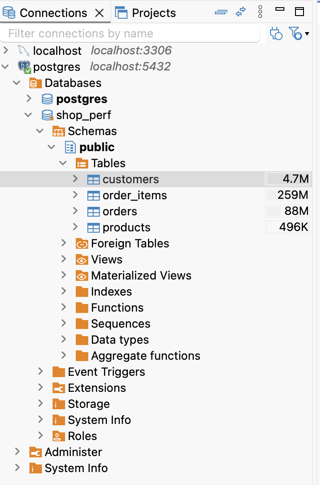

# Pre-install

## Script

```postgreSQL
CREATE TABLE customers (
    id BIGSERIAL PRIMARY KEY,
    email TEXT NOT NULL,
    country TEXT NOT NULL,
    created_at TIMESTAMPTZ NOT NULL DEFAULT now()
);

CREATE TABLE products (
    id BIGSERIAL PRIMARY KEY,
    name TEXT NOT NULL,
    category TEXT NOT NULL,
    price NUMERIC(10,2) NOT NULL
);

CREATE TABLE orders (
    id BIGSERIAL PRIMARY KEY,
    customer_id BIGINT NOT NULL REFERENCES customers(id),
    status TEXT NOT NULL,          -- 'pending','paid','shipped','cancelled'
    created_at TIMESTAMPTZ NOT NULL DEFAULT now(),
    total NUMERIC(10,2) NOT NULL
);

CREATE TABLE order_items (
    id BIGSERIAL PRIMARY KEY,
    order_id BIGINT NOT NULL REFERENCES orders(id),
    product_id BIGINT NOT NULL REFERENCES products(id),
    quantity INT NOT NULL,
    unit_price NUMERIC(10,2) NOT NULL
);

INSERT INTO customers (email, country, created_at)
SELECT 'user' || g || '@example.com',
       (ARRAY['VN','US','SG','JP','TH'])[floor(random()*5+1)],
       now() - (random() * interval '730 days')
FROM generate_series(1, 50000) g;

INSERT INTO products (name, category, price)
SELECT 'Product ' || g,
       (ARRAY['electronics','fashion','home','books','toys'])[floor(random()*5+1)],
       round((random()*500 + 5)::numeric, 2)
FROM generate_series(1, 5000) g;

INSERT INTO orders (customer_id, status, created_at, total)
SELECT floor(random()*50000+1),
       (ARRAY['pending','paid','shipped','cancelled'])[floor(random()*4+1)],
       now() - (random() * interval '730 days'),
       round((random()*1000 + 10)::numeric, 2)
FROM generate_series(1, 1000000) g;

INSERT INTO order_items (order_id, product_id, quantity, unit_price)
SELECT floor(random()*1000000+1),
       floor(random()*5000+1),
       floor(random()*5+1),
       round((random()*500 + 5)::numeric, 2)
FROM generate_series(1, 3000000) g;

ANALYZE;
```

## Result


