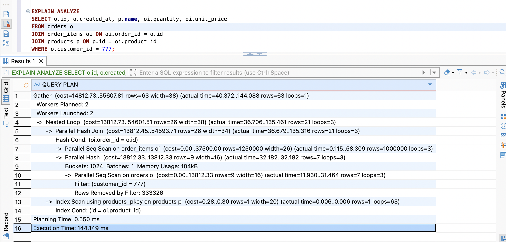
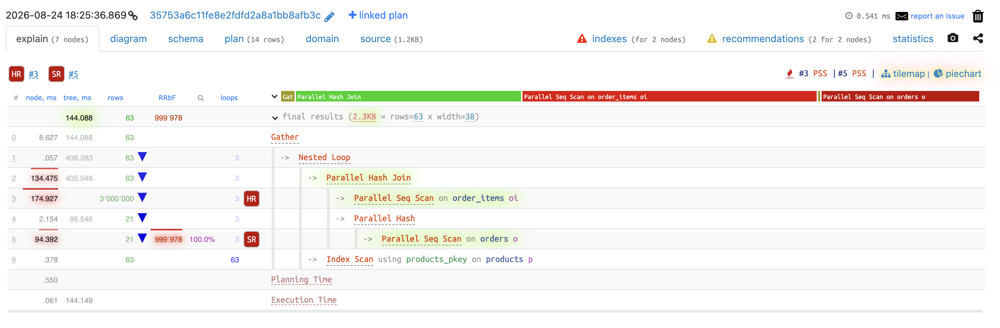
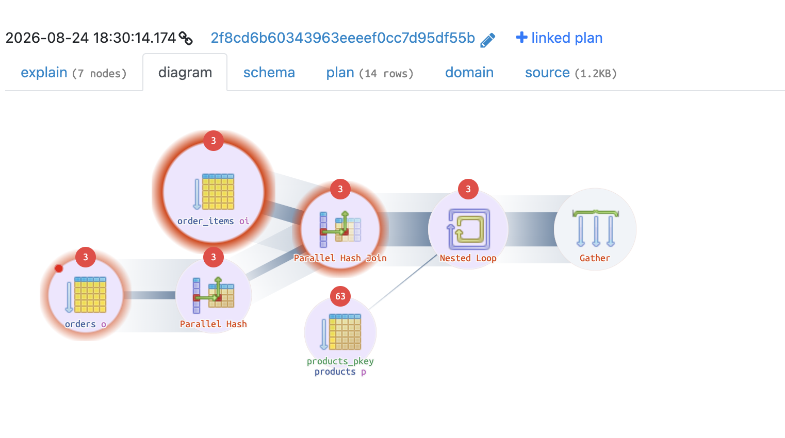
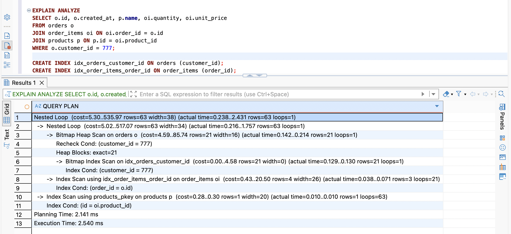

# Query 2

## Script

```postgreSQL
SELECT o.id, o.created_at, p.name, oi.quantity, oi.unit_price
FROM orders o
JOIN order_items oi ON oi.order_id = o.id
JOIN products p ON p.id = oi.product_id
WHERE o.customer_id = 777;
```

## Execution Time

```
Gather  (cost=14812.73..55607.81 rows=63 width=38) (actual time=40.372..144.088 rows=63 loops=1)
  Workers Planned: 2
  Workers Launched: 2
  ->  Nested Loop  (cost=13812.73..54601.51 rows=26 width=38) (actual time=36.706..135.461 rows=21 loops=3)
        ->  Parallel Hash Join  (cost=13812.45..54593.71 rows=26 width=34) (actual time=36.679..135.316 rows=21 loops=3)
              Hash Cond: (oi.order_id = o.id)
              ->  Parallel Seq Scan on order_items oi  (cost=0.00..37500.00 rows=1250000 width=26) (actual time=0.115..58.309 rows=1000000 loops=3)
              ->  Parallel Hash  (cost=13812.33..13812.33 rows=9 width=16) (actual time=32.182..32.182 rows=7 loops=3)
                    Buckets: 1024  Batches: 1  Memory Usage: 104kB
                    ->  Parallel Seq Scan on orders o  (cost=0.00..13812.33 rows=9 width=16) (actual time=11.930..31.464 rows=7 loops=3)
                          Filter: (customer_id = 777)
                          Rows Removed by Filter: 333326
        ->  Index Scan using products_pkey on products p  (cost=0.28..0.30 rows=1 width=20) (actual time=0.006..0.006 rows=1 loops=63)
              Index Cond: (id = oi.product_id)
Planning Time: 0.550 ms
Execution Time: 144.149 ms
```





## Explain

```
Parallel Seq Scan on orders o  (cost=0.00..13812.33 rows=9 width=16) (actual time=11.930..31.464 rows=7 loops=3)
                          Filter: (customer_id = 777)
                          Rows Removed by Filter: 333326
```
-> Quét toàn bộ bảng chỉ để tìm ra 7 dòng khớp điều kiện `customer_id = 777`; số lượng removed by filter cũng khá lớn ~ 33k, cho thấy sự lãng phí (đọc nhiều, bỏ đi nhiều và giữ lại quá ít).

```
->  Parallel Hash  (cost=13812.33..13812.33 rows=9 width=16) (actual time=32.182..32.182 rows=7 loops=3)
                    Buckets: 1024  Batches: 1  Memory Usage: 104kB
```
-> 7 dòng được đưa tiếp vào hash table để phục vụ cho bước join tiếp theo.

`->  Parallel Seq Scan on order_items oi  (cost=0.00..37500.00 rows=1250000 width=26) (actual time=0.115..58.309 rows=1000000 loops=3)`

-> Quét toàn bộ bảng `order_items` để so khớp `order_id` với hash table có 7 giá trị (thời gian tiêu tốn cao nhất ~58ms).

```
->  Parallel Hash Join  (cost=13812.45..54593.71 rows=26 width=34) (actual time=36.679..135.316 rows=21 loops=3)
              Hash Cond: (oi.order_id = o.id)
```
Sau khi có 1 triệu dòng từ `order_items`, so khớp từng dòng với hash table - dù hash table nhỏ (chỉ 7 dòng), vẫn cần lặp qua 1 triệu dòng (thời gian tiêu tốn: 44).

`->  Nested Loop  (cost=13812.73..54601.51 rows=26 width=38) (actual time=36.706..135.461 rows=21 loops=3)`

Với mỗi dòng đã join được, thực hiện tiếp bước tra `products`.

```
->  Index Scan using products_pkey on products p  (cost=0.28..0.30 rows=1 width=20) (actual time=0.006..0.006 rows=1 loops=63)
              Index Cond: (id = oi.product_id)
```
-> Tra `products` qua primary key index.

## Optimization Proposal

Có 2 điểm nghẽn chính đó là 2 lần Seq Scan:
1. Quét toàn bộ `orders` (1 triệu dòng) chỉ để tìm 7 dòng của 1 khách hàng.
2. Quét toàn bộ `order_items` (3 triệu dòng) chỉ để tìm ~63 dòng khớp với 7 order đó.

-> Tạo index cho 2 bảng này: bảng `orders` đánh index cho `customer_id` (phục vụ tìm kiếm theo `customer_id` nhanh hơn), còn bảng `order_items` thì đánh index cho `order_id`.

```postgreSQL
CREATE INDEX idx_orders_customer_id ON orders (customer_id);
CREATE INDEX idx_order_items_order_id ON order_items (order_id);
```

## Result



Thời gian thực thi giảm từ 144.149 ms còn 2.540 ms. Thay thế Seq Scan thành tra cứu trực tiếp từ index của 2 bảng.
