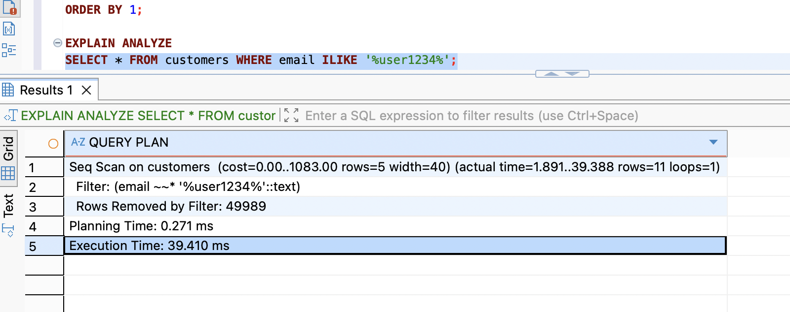
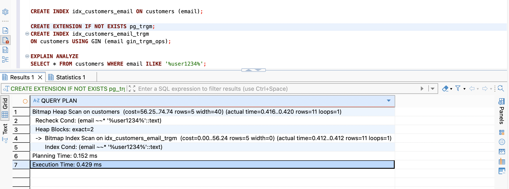

# Query 4

## Script

```postgreSQL
SELECT * FROM customers WHERE email ILIKE '%user1234%';
```

## Execution Time

```
Seq Scan on customers  (cost=0.00..1083.00 rows=5 width=40) (actual time=1.891..39.388 rows=11 loops=1)
  Filter: (email ~~* '%user1234%'::text)
  Rows Removed by Filter: 49989
Planning Time: 0.271 ms
Execution Time: 39.410 ms
```



## Explain

`Seq Scan on customers  (actual time=1.891..39.388 rows=11 loops=1)`

-> Quét toàn bộ bảng `customers` (50k dòng) để tìm được 11 dòng thoả mãn điều kiện (~39.410 ms).

## Optimization Proposal

- Đã thử thêm index cho `email` nhưng vì có dấu `%` ở đầu chuỗi (leading wildcard) -> Postgres không dùng được b-tree index (chỉ hiệu quả nếu tìm theo prefix) -> Postgres vẫn dùng Seq Scan.

- Dùng extension `pg_trgm` + GIN index. `pg_trgm` tách chuỗi thành các "trigram" (cụm 3 ký tự liên tiếp, ví dụ `email` → `ema`, `mai`, `ail`...). GIN index lưu các trigram này, cho phép Postgres tìm nhanh các dòng có chứa cụm ký tự tương ứng với chuỗi cần tìm.

## Result



Thay vì Seq Scan toàn bộ bảng thì đã chuyển sang Bitmap Index Scan giúp giảm thời gian thực thi từ 39.410 ms xuống 0.429 ms.
