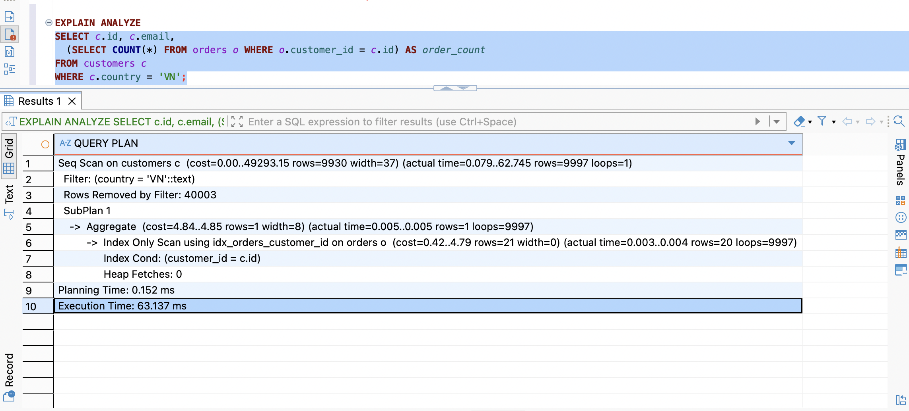
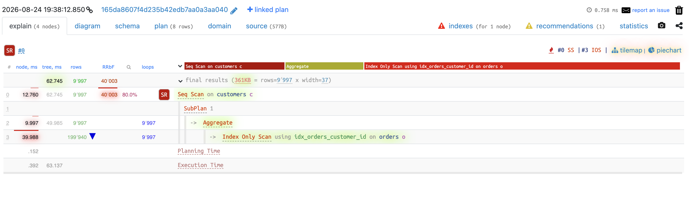
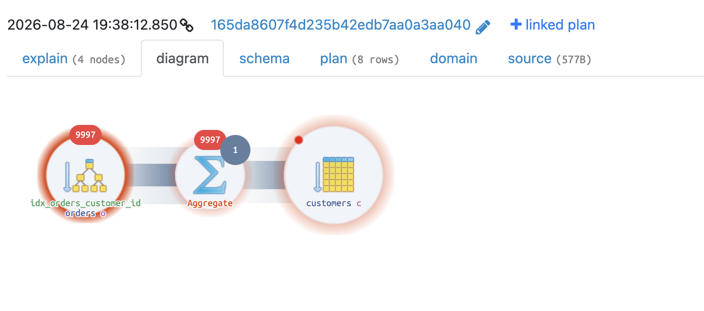
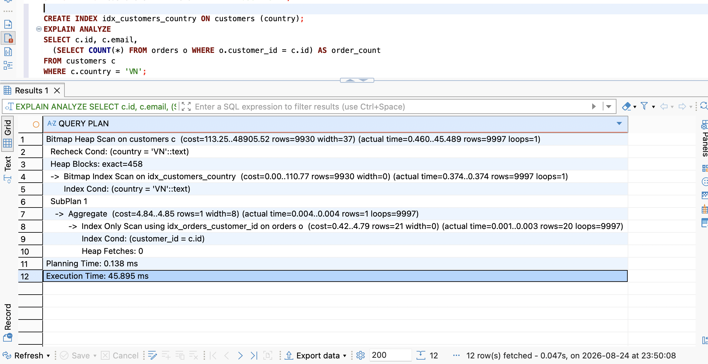

# Query 5

## Script

```postgreSQL
SELECT c.id, c.email,
  (SELECT COUNT(*) FROM orders o WHERE o.customer_id = c.id) AS order_count
FROM customers c
WHERE c.country = 'VN';
```

## Execution Time

```
Seq Scan on customers c  (cost=0.00..49293.15 rows=9930 width=37) (actual time=0.079..62.745 rows=9997 loops=1)
  Filter: (country = 'VN'::text)
  Rows Removed by Filter: 40003
  SubPlan 1
    ->  Aggregate  (cost=4.84..4.85 rows=1 width=8) (actual time=0.005..0.005 rows=1 loops=9997)
          ->  Index Only Scan using idx_orders_customer_id on orders o  (cost=0.42..4.79 rows=21 width=0) (actual time=0.003..0.004 rows=20 loops=9997)
                Index Cond: (customer_id = c.id)
                Heap Fetches: 0
Planning Time: 0.152 ms
Execution Time: 63.137 ms
```





## Explain

```
->  Index Only Scan using idx_orders_customer_id on orders o  (cost=0.42..4.79 rows=21 width=0) (actual time=0.003..0.004 rows=20 loops=9997)
                Index Cond: (customer_id = c.id)
                Heap Fetches: 0
```
-> Với 1 giá trị `c.id` cụ thể (được truyền từ ngoài vào), tra index `idx_orders_customer_id` để tìm các dòng `orders` có `customer_id` trùng khớp. Gọi lại 9.997 lần, mỗi lần ứng với 1 giá trị `c.id` khác nhau.

`->  Aggregate  (cost=4.84..4.85 rows=1 width=8) (actual time=0.005..0.005 rows=1 loops=9997)`

Nhận các dòng từ Index Only Scan, tính `COUNT(*)` → trả về 1 dòng kết quả (con số đếm). Chạy loops=9997 lần - mỗi lần đếm cho 1 khách hàng.

```
Seq Scan on customers c  (cost=0.00..49293.15 rows=9930 width=37) (actual time=0.079..62.745 rows=9997 loops=1)
  Filter: (country = 'VN'::text)
  Rows Removed by Filter: 40003
```
-> Quét toàn bộ 50.000 dòng `customers`, áp dụng `Filter: country = 'VN'`, giữ lại 9.997 dòng. Với mỗi dòng còn lại sau filter, Postgres gọi SubPlan 1.

## Optimization Proposal

- Giải quyết Seq Scan trên `customers` do thiếu index.

## Result



Chuyển từ Seq Scan (toàn bảng) sang Bitmap Index Scan. Thời gian thực thi giảm từ 63.137 ms xuống 45.895 ms.
