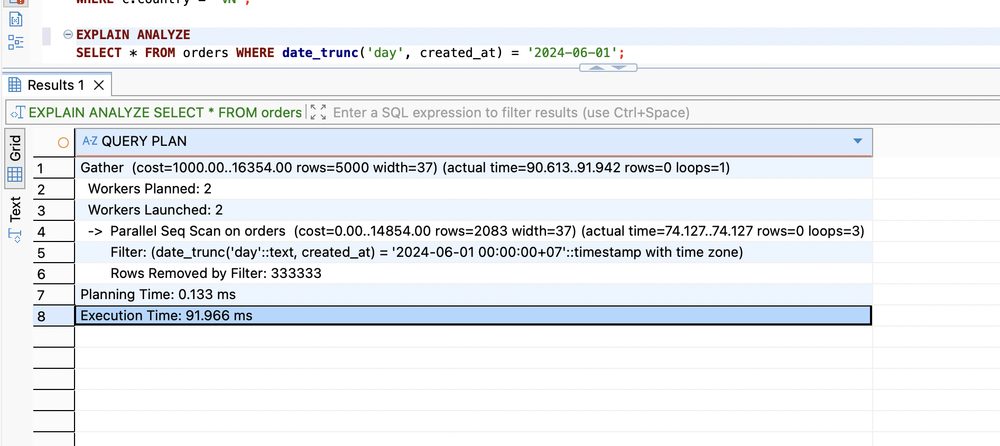
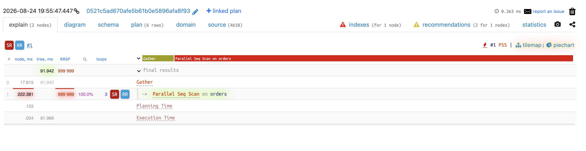
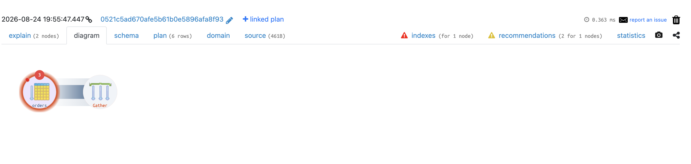
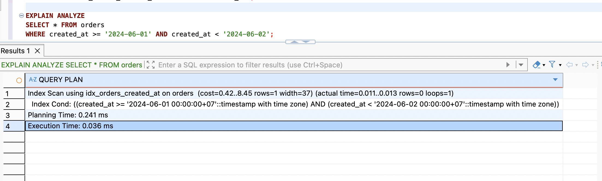

# Query 6

## Script

```postgreSQL
SELECT * FROM orders WHERE date_trunc('day', created_at) = '2024-06-01';
```

## Execution Time

```
Gather  (cost=1000.00..16354.00 rows=5000 width=37) (actual time=90.613..91.942 rows=0 loops=1)
  Workers Planned: 2
  Workers Launched: 2
  ->  Parallel Seq Scan on orders  (cost=0.00..14854.00 rows=2083 width=37) (actual time=74.127..74.127 rows=0 loops=3)
        Filter: (date_trunc('day'::text, created_at) = '2024-06-01 00:00:00+07'::timestamp with time zone)
        Rows Removed by Filter: 333333
Planning Time: 0.133 ms
Execution Time: 91.966 ms
```





## Explain

```
->  Parallel Seq Scan on orders  (cost=0.00..14854.00 rows=2083 width=37) (actual time=74.127..74.127 rows=0 loops=3)
        Filter: (date_trunc('day'::text, created_at) = '2024-06-01 00:00:00+07'::timestamp with time zone)
        Rows Removed by Filter: 333333
```
-> Quét toàn bộ bảng `orders`, với mỗi dòng, tính `date_trunc('day', created_at)` rồi mới so sánh với `'2024-06-01'`.

```
Gather  (cost=1000.00..16354.00 rows=5000 width=37) (actual time=90.613..91.942 rows=0 loops=1)
  Workers Planned: 2
  Workers Launched: 2
```
-> Gộp kết quả từ các loops trước đó.

## Optimization Proposal

- Mục đích của câu query là lấy ra được toàn bộ đơn hàng trong ngày 2024-06-01 -> có thể cập nhật lại query để giảm bớt việc phải tính toán hàm `date_trunc` cho mỗi dòng.
- Tạo index cho cột `created_at` để tránh phải dùng Seq Scan.

## Result



Chuyển hoàn toàn từ Parallel Seq Scan sang Index Scan không cần chạy parallel, thời gian từ 91.966ms xuống 0.036ms.
