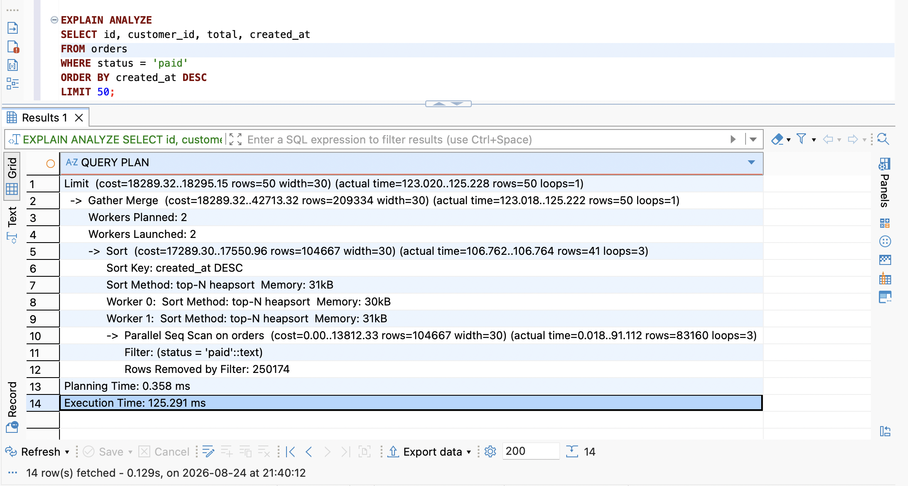
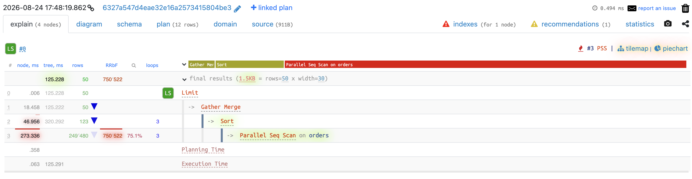
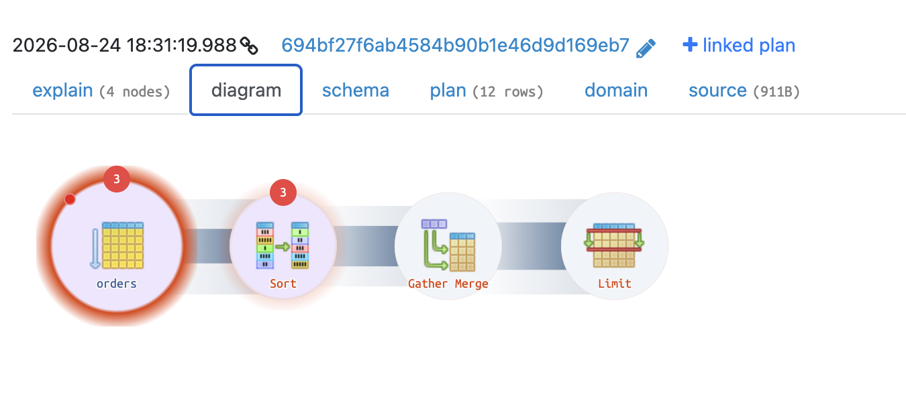
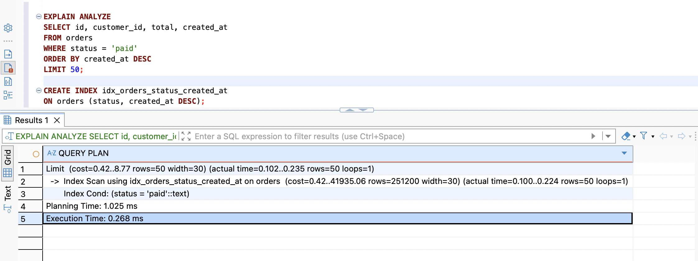

# Query 1

## Script

```postgreSQL
SELECT id, customer_id, total, created_at
FROM orders
WHERE status = 'paid'
ORDER BY created_at DESC
LIMIT 50;
```

## Execution Time

```
Limit  (cost=18289.32..18295.15 rows=50 width=30) (actual time=123.020..125.228 rows=50 loops=1)
  ->  Gather Merge  (cost=18289.32..42713.32 rows=209334 width=30) (actual time=123.018..125.222 rows=50 loops=1)
        Workers Planned: 2
        Workers Launched: 2
        ->  Sort  (cost=17289.30..17550.96 rows=104667 width=30) (actual time=106.762..106.764 rows=41 loops=3)
              Sort Key: created_at DESC
              Sort Method: top-N heapsort  Memory: 31kB
              Worker 0:  Sort Method: top-N heapsort  Memory: 30kB
              Worker 1:  Sort Method: top-N heapsort  Memory: 31kB
              ->  Parallel Seq Scan on orders  (cost=0.00..13812.33 rows=104667 width=30) (actual time=0.018..91.112 rows=83160 loops=3)
                    Filter: (status = 'paid'::text)
                    Rows Removed by Filter: 250174
Planning Time: 0.358 ms
Execution Time: 125.291 ms
```





## Explain

`Parallel Seq Scan on orders (cost=0.00..13812.33 rows=104667 width=30) (actual time=0.018..91.112 rows=83160 loops=3)` -> quét toàn bộ ~1 triệu dòng để tìm ra các dòng có `status = 'paid'` (loops=3 ~ 3 tiến trình cùng chạy ~ chia dữ liệu thành 3 phần để mỗi tiến trình quét 1/3 dữ liệu), tiêu tốn 91ms (chi phí cao nhất).

```
Sort  (cost=17289.30..17550.96 rows=104667 width=30) (actual time=106.762..106.764 rows=41 loops=3)
              Sort Key: created_at DESC
              Sort Method: top-N heapsort  Memory: 31kB
              Worker 0:  Sort Method: top-N heapsort  Memory: 30kB
              Worker 1:  Sort Method: top-N heapsort  Memory: 31kB
```
-> Sau khi lọc, sắp xếp giảm dần theo `created_at` (chú ý thêm là sort method dùng top-N heapsort vì chỉ cần giữ lại 50 dòng theo như query giúp giảm đáng kể lượng bộ nhớ sử dụng), ở đây cũng chạy loops 3.

```
->  Gather Merge  (cost=18289.32..42713.32 rows=209334 width=30) (actual time=123.018..125.222 rows=50 loops=1)
        Workers Planned: 2
        Workers Launched: 2
```
Sau khi sắp xếp xong bằng 3 tiến trình -> chạy merge để gộp dữ liệu lại thành 1, giữ đúng thứ tự sắp xếp và giữ lại limit 50.

`Limit (cost=18289.32..18295.15 rows=50 width=30) (actual time=123.020..125.228 rows=50 loops=1)`

Trả kết quả cuối cùng cho người dùng = 50 dòng.

## Optimization Proposal

Vì phần lớn thời gian tiêu tốn ở 2 bước là quét (scan) và sắp xếp (sort) -> đánh index cho 2 bước này bằng composite index. Thứ tự index sẽ là `status`, `created_at DESC` bởi vì thu hẹp phạm vi ngay từ đầu giúp giảm thời gian tiêu tốn hơn.

```postgreSQL
CREATE INDEX idx_orders_status_created_at
ON orders (status, created_at DESC);
```

## Result



Thời gian thực thi giảm từ 125.291ms xuống 0.268ms. Thay vì dùng Parallel Seq Scan (toàn bảng) thì chuyển sang dùng Index Scan (trực tiếp). Không cần dùng đến SORT nữa (theo index đã có sẵn).
