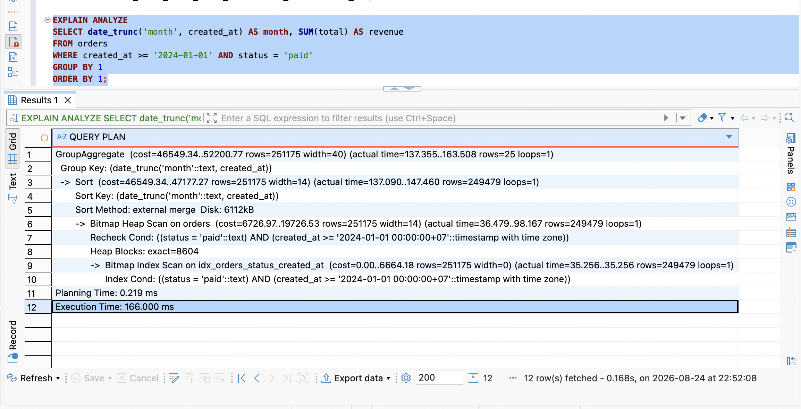
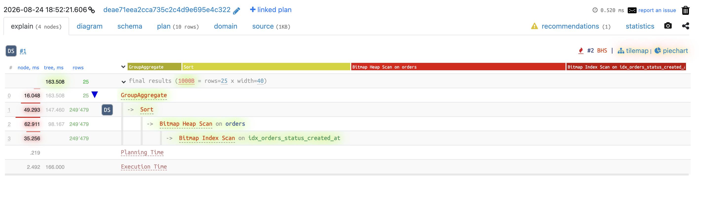
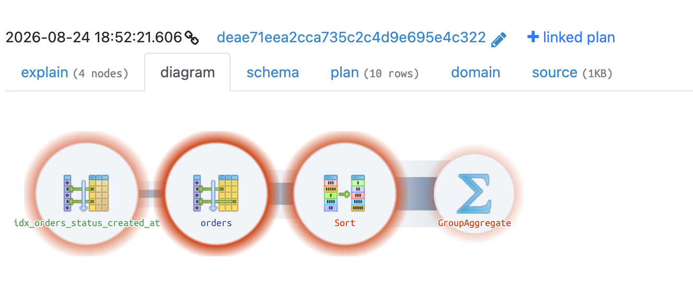
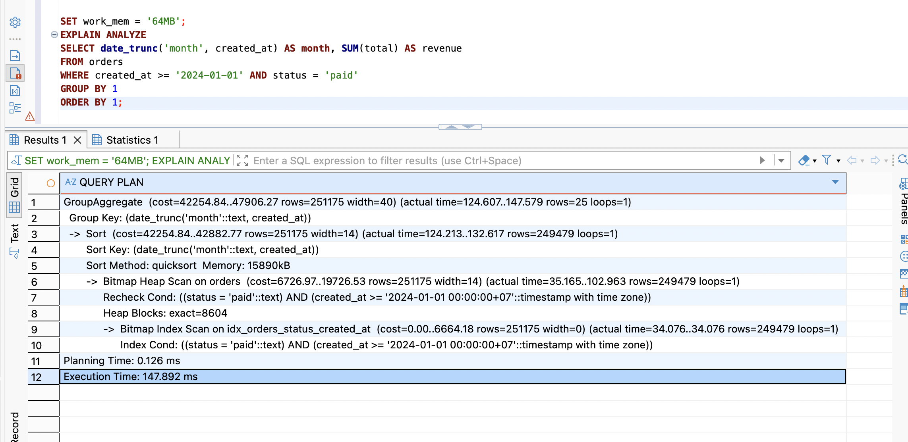

# Query 3

## Script

```postgreSQL
SELECT date_trunc('month', created_at) AS month, SUM(total) AS revenue
FROM orders
WHERE created_at >= '2024-01-01' AND status = 'paid'
GROUP BY 1
ORDER BY 1;
```

## Execution Time

```
GroupAggregate  (cost=46549.34..52200.77 rows=251175 width=40) (actual time=137.355..163.508 rows=25 loops=1)
  Group Key: (date_trunc('month'::text, created_at))
  ->  Sort  (cost=46549.34..47177.27 rows=251175 width=14) (actual time=137.090..147.460 rows=249479 loops=1)
        Sort Key: (date_trunc('month'::text, created_at))
        Sort Method: external merge  Disk: 6112kB
        ->  Bitmap Heap Scan on orders  (cost=6726.97..19726.53 rows=251175 width=14) (actual time=36.479..98.167 rows=249479 loops=1)
              Recheck Cond: ((status = 'paid'::text) AND (created_at >= '2024-01-01 00:00:00+07'::timestamp with time zone))
              Heap Blocks: exact=8604
              ->  Bitmap Index Scan on idx_orders_status_created_at  (cost=0.00..6664.18 rows=251175 width=0) (actual time=35.256..35.256 rows=249479 loops=1)
                    Index Cond: ((status = 'paid'::text) AND (created_at >= '2024-01-01 00:00:00+07'::timestamp with time zone))
Planning Time: 0.219 ms
Execution Time: 166.000 ms
```





## Explain

```
->  Bitmap Index Scan on idx_orders_status_created_at  (cost=0.00..6664.18 rows=251175 width=0) (actual time=35.256..35.256 rows=249479 loops=1)
                    Index Cond: ((status = 'paid'::text) AND (created_at >= '2024-01-01 00:00:00+07'::timestamp with time zone))
```
-> Tìm các dòng thoả mãn cả 2 điều kiện `status = 'paid'` và `created_at >= '2024-01-01'` bằng Bitmap Index Scan -> tìm được 249k dòng khớp, mất ~35ms.

```
->  Bitmap Heap Scan on orders  (cost=6726.97..19726.53 rows=251175 width=14) (actual time=36.479..98.167 rows=249479 loops=1)
              Recheck Cond: ((status = 'paid'::text) AND (created_at >= '2024-01-01 00:00:00+07'::timestamp with time zone))
              Heap Blocks: exact=8604
```
-> Đọc lại dữ liệu từ index scan ở bước 1.

```
->  Sort  (cost=46549.34..47177.27 rows=251175 width=14) (actual time=137.090..147.460 rows=249479 loops=1)
        Sort Key: (date_trunc('month'::text, created_at))
        Sort Method: external merge  Disk: 6112kB
```
-> Vì index ở bước 1 chỉ theo cột `created_at` -> vẫn cần sắp xếp lại từ đầu. Khi sắp xếp thì Postgres sẽ chạy quick sort (với dữ liệu được nạp toàn bộ vào RAM) nếu dữ liệu có dung lượng vừa với `work_mem` (`SHOW work_mem;`) -> sau đó trả kết quả. Còn nếu không vừa thì chia nhỏ dữ liệu thành các phần bằng với `work_mem` -> sắp xếp từng batch -> đọc file đã sắp xếp -> merge lại -> thành kết quả hoàn chỉnh -> ở đây ghi dữ liệu (write I/O) sau đó đọc lại sẽ chậm hơn nhiều.

```
GroupAggregate  (cost=46549.34..52200.77 rows=251175 width=40) (actual time=137.355..163.508 rows=25 loops=1)
  Group Key: (date_trunc('month'::text, created_at))
```
-> Duyệt tuần tự và gom nhóm các dòng có cùng tháng, tính SUM cho từng nhóm.

## Optimization Proposal

- Đã thử cách thêm index cho phần `date_trunc('month', created_at)` nhưng `date_trunc` phụ thuộc vào time_zone - có thể thay đổi tuỳ theo cấu hình session = MUTABLE nên không đánh index được.
- Tăng `work_mem` để giảm thời gian đọc/ghi: `SET work_mem = '64MB';`

## Result



Phần sort giảm từ 166ms xuống còn khoảng 147ms.
