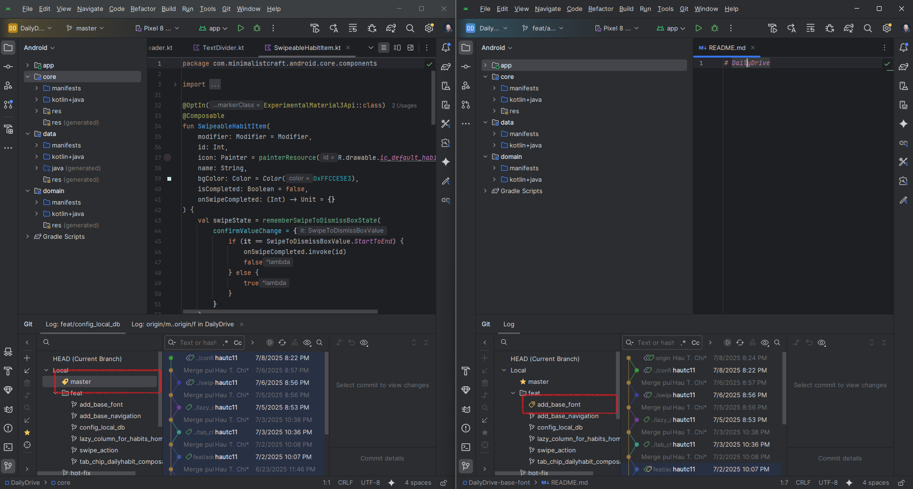
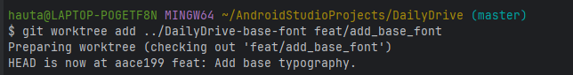
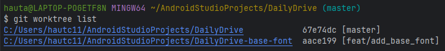
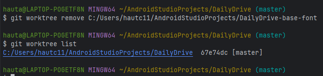

# Git Worktree
As an Android Developer, I often faced this scenario:
I'm working on `feature/add-chip-view-for-records-list-scr` but need to quickly reference the code in another branch. 
Usually, I would use `git checkout` to handle this. However, it sometime disrupts my workflow, especially if I have uncommitted changes or long Gradle sync times.

→ That is where `git worktree` come to help. It allowing a secondary branch to be open in a seperate window without disturbing the current environment.

Like this:



## Why not just clone the repo twice?

1. Duplicate disk space.
2. Sync issues.
3. Manageing mutiple clones complicates.

## Essential Commands

**Creating a Worktree**

To create a new directory and checkout a new branch:
```sh
#From an existing branch
git worktree add ../path-to-dir branch-name

#Checkout a new branch
git worktree add ../path-to-dir -b branch-name
```


**List all worktrees**

To see all active worktrees and their locations:
```sh
git worktree list
```


**Remove a worktree**

To safely delete a worktree and its metadata:
```sh
git worktree remove <path-to-dir>
```


**Prune worktrees**

To clean up metadata if a worktree directory was deleted manually:
```sh
git worktree prune
```